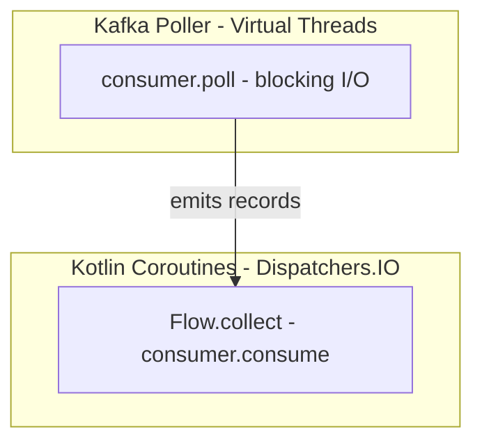

# Kafka Flow

A Kotlin Flow-based Kafka consumer/producer library built on Spring Kafka. Write **lean consumers** that focus purely on business logic. All retry, DLT, and metrics handling is automatic.

## Features

- **Lean Consumer Pattern**: Just implement `suspend fun consume(record)`, no boilerplate
- **Flow-based API**: Consume Kafka messages as Kotlin Flows with backpressure
- **Dual Poller Support**: Spring Kafka (default) or Reactor Kafka backends
- **Coroutine-native**: Fully suspend-based, non-blocking async publishing
- **Virtual Threads**: JDK 21+ Virtual Threads for Kafka polling (configurable)
- **Two-stage Retry**: In-memory retries, Retry Topic, Dead Letter Topic
- **Per-consumer Config**: All policies configurable via `@KafkaTopic` annotation
- **Exception Classification**: Retryable vs NonRetryable, skip retries for validation errors
- **TTL Support**: Expire messages by retry duration or message age
- **Metrics Interface**: Pluggable observability (`NoOp`, `Logging`, `Micrometer`)
- **Spring Kafka Powered**: Battle-tested rebalancing, commits, and lifecycle
- **No Spring Boot Required**: Works with Ktor, http4k, or any framework

## Installation

```kotlin
dependencies {
    implementation("io.github.osoykan:kafka-flow:0.1.0")
    
    // Optional: For Reactor Kafka poller
    implementation("io.projectreactor.kafka:reactor-kafka:1.3.24")
    implementation("org.jetbrains.kotlinx:kotlinx-coroutines-reactor:1.10.2")
}
```

## Quick Start

### The Lean Consumer Pattern (Recommended)

Write consumers that focus only on business logic:

```kotlin
@KafkaTopic(
    name = "orders.created",
    retry = "orders.created.retry",
    dlt = "orders.created.dlt",
    maxInMemoryRetries = 3,
    maxRetryTopicAttempts = 2
)
class OrderCreatedConsumer(
    private val orderService: OrderService
) : ConsumerAutoAck<String, OrderEvent> {
    
    // Retry, DLT, and metrics are handled by the supervisor
    override suspend fun consume(record: ConsumerRecord<String, OrderEvent>) {
        orderService.processOrder(record.value())
    }
}
```

**What happens automatically:**
- ✅ In-memory retries with exponential backoff
- ✅ Send to retry topic when in-memory retries exhausted
- ✅ Send to DLT when retry topic attempts exhausted
- ✅ Exception classification (validation errors → DLT immediately)
- ✅ TTL checks (expire old messages)
- ✅ Metrics recording
- ✅ Automatic acknowledgment on success

## Configuration

### @KafkaTopic Annotation

All policies are configurable per consumer:

```kotlin
@KafkaTopic(
    // ─────────────────────────────────────────────────────────
    // Topic Configuration
    // ─────────────────────────────────────────────────────────
    name = "payments",                    // Main topic name
    retry = "payments.retry",             // Retry topic (or auto: {name}.retry)
    dlt = "payments.dlt",                 // DLT topic (or auto: {name}.dlt)
    groupId = "payment-service",          // Consumer group (or use default)
    concurrency = 4,                      // Number of concurrent consumers
    
    // ─────────────────────────────────────────────────────────
    // In-Memory Retry Configuration
    // ─────────────────────────────────────────────────────────
    maxInMemoryRetries = 5,               // Retries before sending to retry topic
    backoffMs = 100,                      // Initial backoff delay
    backoffMultiplier = 2.0,              // Exponential multiplier
    maxBackoffMs = 30_000,                // Maximum backoff cap
    
    // ─────────────────────────────────────────────────────────
    // Retry Topic Configuration
    // ─────────────────────────────────────────────────────────
    maxRetryTopicAttempts = 3,            // Attempts from retry topic before DLT
    retryTopicBackoffMs = 1_000,          // Backoff when processing from retry topic
    retryTopicBackoffMultiplier = 2.0,
    maxRetryTopicBackoffMs = 60_000,
    
    // ─────────────────────────────────────────────────────────
    // TTL Configuration
    // ─────────────────────────────────────────────────────────
    maxRetryDurationMs = 300_000,         // 5 min max from first failure
    maxMessageAgeMs = 600_000,            // 10 min max from original timestamp
    
    // ─────────────────────────────────────────────────────────
    // Exception Classification
    // ─────────────────────────────────────────────────────────
    classifier = ClassifierType.DEFAULT,  // DEFAULT, ALWAYS_RETRY, NEVER_RETRY
    nonRetryableExceptions = [            // Additional non-retryable exceptions
        MyValidationException::class
    ]
)
class PaymentConsumer : ConsumerAutoAck<String, PaymentEvent> {
    override suspend fun consume(record: ConsumerRecord<String, PaymentEvent>) {
        // Your business logic
    }
}
```

### Programmatic Configuration

```kotlin
val config = KafkaFlowConfig(
    bootstrapServers = "localhost:9092",
    consumer = ConsumerConfig(
        groupId = "my-service",
        autoOffsetReset = "earliest"
    ),
    producer = ProducerConfig(
        acks = "all",
        retries = 3
    ),
    listener = ListenerConfig(
        concurrency = 4,
        pollTimeout = 1.seconds,
        useVirtualThreads = true  // JDK 21+ Virtual Threads for polling
    )
)
```

## Exception Classification

Control which exceptions trigger retries:

```kotlin
// DEFAULT: Validation errors go to DLT immediately
// (IllegalArgumentException, NullPointerException, ClassCastException, etc.)
@KafkaTopic(name = "orders", classifier = ClassifierType.DEFAULT)

// ALWAYS_RETRY: Retry all exceptions (good for external APIs)
@KafkaTopic(name = "notifications", classifier = ClassifierType.ALWAYS_RETRY)

// NEVER_RETRY: Never retry (idempotency-critical operations)
@KafkaTopic(name = "payments-critical", classifier = ClassifierType.NEVER_RETRY)
```

**Default non-retryable exceptions:**
- `IllegalArgumentException`
- `IllegalStateException`
- `NullPointerException`
- `ClassCastException`
- `NumberFormatException`
- `UnsupportedOperationException`
- `IndexOutOfBoundsException`
- `NoSuchElementException`

**Add custom non-retryable exceptions:**

```kotlin
@KafkaTopic(
    name = "orders",
    classifier = ClassifierType.DEFAULT,
    nonRetryableExceptions = [
        InvalidOrderException::class,
        DuplicateOrderException::class
    ]
)
```

## Retry Flow


**Summary:**
1. **TTL Check**: Expire old messages immediately
2. **Classification**: Non-retryable exceptions skip to DLT
3. **In-memory retries**: Fast recovery for transient failures
4. **Retry topic**: Durable retry for persistent issues
5. **DLT**: Permanent failure storage

## Backoff Strategies

```kotlin
// Fixed delay between retries
BackoffStrategy.Fixed(delay = 1.seconds)
// Delays: 1s → 1s → 1s → ...

// Exponential backoff (default)
BackoffStrategy.Exponential(
    initialDelay = 100.milliseconds,
    multiplier = 2.0,
    maxDelay = 30.seconds
)
// Delays: 100ms → 200ms → 400ms → 800ms → ... → 30s (capped)

// No delay (for testing)
BackoffStrategy.None
// Delays: 0 → 0 → 0 → ...
```

## TTL / Max Age Support

Prevent stale messages from processing indefinitely:

```kotlin
@KafkaTopic(
    name = "time-sensitive-orders",
    maxRetryDurationMs = 300_000,   // Max 5 minutes from first failure
    maxMessageAgeMs = 600_000       // Max 10 minutes from original timestamp
)
```

**Two dimensions:**
- `maxRetryDuration`: Time since first failure (tracked via `kafka.first.failure.time` header)
- `maxMessageAge`: Time since original message timestamp

Expired messages are sent to DLT with expiry reason in headers.

## Polling Backends

Kafka Flow supports two polling backends with the same Flow API:

| Backend | Best For | Virtual Threads |
|---------|----------|-----------------|
| **Spring Kafka** (default) | Most use cases, Spring ecosystem | `SimpleAsyncTaskExecutor.setVirtualThreads(true)` |
| **Reactor Kafka** | Reactive stacks, non-Spring apps | `-Dreactor.schedulers.defaultBoundedElasticOnVirtualThreads=true` |

### Spring Kafka Poller (Default)

```kotlin
// Uses ConcurrentMessageListenerContainer internally
val consumer = FlowKafkaConsumer(consumerFactory, listenerConfig)

consumer.consume(TopicConfig(name = "orders"))
    .collect { record -> process(record) }
```

### Reactor Kafka Poller

```kotlin
// Add dependency: io.projectreactor.kafka:reactor-kafka
// Add dependency: org.jetbrains.kotlinx:kotlinx-coroutines-reactor

val receiverOptions = ReceiverOptions.create<String, String>(
    mapOf(
        ConsumerConfig.BOOTSTRAP_SERVERS_CONFIG to "localhost:9092",
        ConsumerConfig.GROUP_ID_CONFIG to "my-group",
        ConsumerConfig.AUTO_OFFSET_RESET_CONFIG to "earliest",
        ConsumerConfig.KEY_DESERIALIZER_CLASS_CONFIG to StringDeserializer::class.java,
        ConsumerConfig.VALUE_DESERIALIZER_CLASS_CONFIG to StringDeserializer::class.java
    )
)

val poller = ReactorKafkaPoller(receiverOptions)
val consumer = FlowKafkaConsumer.withPoller(poller)

consumer.consume(TopicConfig(name = "orders"))
    .collect { record -> process(record) }
```

### Manual Acknowledgment with Reactor Kafka

```kotlin
poller.pollWithAck(TopicConfig(name = "orders")).collect { ackable ->
    try {
        process(ackable.record)
        ackable.acknowledge()  // Commit offset
    } catch (e: Exception) {
        // Don't acknowledge, will be redelivered
    }
}
```

## Virtual Threads

JDK 21+ Virtual Threads optimize the blocking `consumer.poll()` operation. Configuration differs by poller:

### Spring Kafka Virtual Threads

```kotlin
ListenerConfig(
    useVirtualThreads = true  // Default: enabled
)
```

Internally uses `SimpleAsyncTaskExecutor.setVirtualThreads(true)` per container.

### Reactor Kafka Virtual Threads

Set the system property before creating pollers:

```bash
-Dreactor.schedulers.defaultBoundedElasticOnVirtualThreads=true
```

Or programmatically:

```kotlin
System.setProperty("reactor.schedulers.defaultBoundedElasticOnVirtualThreads", "true")
```

This makes `Schedulers.boundedElastic()` use Virtual Threads globally.

### Architecture



- **Virtual Threads**: For blocking Kafka polling (cheap, unlimited)
- **Coroutines**: For message processing (suspendable, composable)

## Metrics

Implement `KafkaFlowMetrics` for comprehensive observability:

```kotlin
interface KafkaFlowMetrics {
    // Consumer metrics
    fun recordConsumed(topic: String, consumer: String, partition: Int)
    fun recordProcessingSuccess(topic: String, consumer: String, duration: Duration)
    fun recordProcessingFailure(topic: String, consumer: String, exception: Throwable)
    
    // Retry metrics
    fun recordInMemoryRetry(topic: String, consumer: String, attempt: Int)
    fun recordSentToRetryTopic(topic: String, retryTopic: String, attempt: Int)
    fun recordSentToDlt(topic: String, dltTopic: String, totalAttempts: Int)
    fun recordExpired(topic: String, consumer: String, reason: String)
    
    // Lifecycle metrics
    fun recordConsumerStarted(consumer: String, topics: List<String>)
    fun recordConsumerStopped(consumer: String)
}
```

**Built-in implementations:**

| Implementation | Description |
|----------------|-------------|
| `NoOpMetrics` | Does nothing (default) |
| `LoggingMetrics` | Logs all metrics at DEBUG/INFO/WARN levels |
| `CompositeMetrics` | Delegates to multiple implementations |

**Example with Micrometer:**

```kotlin
class MicrometerMetrics(private val registry: MeterRegistry) : KafkaFlowMetrics {
    override fun recordConsumed(topic: String, consumer: String, partition: Int) {
        registry.counter("kafka.consumer.consumed", 
            "topic", topic, "consumer", consumer).increment()
    }
    
    override fun recordSentToDlt(topic: String, dltTopic: String, totalAttempts: Int) {
        registry.counter("kafka.consumer.dlt",
            "topic", topic, "dltTopic", dltTopic).increment()
    }
    // ... other metrics
}
```

## Manual Acknowledgment

For explicit control over offset commits:

```kotlin
@KafkaTopic(name = "payments")
class PaymentConsumer : ConsumerManualAck<String, PaymentEvent> {
    
    override suspend fun consume(
        record: ConsumerRecord<String, PaymentEvent>, 
        ack: Acknowledgment
    ) {
        // Process payment
        paymentService.process(record.value())
        
        // Acknowledge only after external side effects complete
        ack.acknowledge()
    }
}
```

**Use cases:**
- Acknowledge only after database transaction commits
- Custom batching logic
- Exactly-once processing patterns

## DLT Handling

Create a separate consumer for permanently failed messages:

```kotlin
@KafkaTopic(
    name = "orders.created.dlt",
    classifier = ClassifierType.NEVER_RETRY  // Don't retry DLT messages!
)
class OrderDltConsumer(
    private val alerting: AlertingService,
    private val ticketService: TicketService
) : ConsumerAutoAck<String, OrderEvent> {
    
    override suspend fun consume(record: ConsumerRecord<String, OrderEvent>) {
        // Extract error context from headers
        val errorClass = record.headers().lastHeader("kafka.exception.class")
            ?.value()?.let { String(it) }
        val errorMessage = record.headers().lastHeader("kafka.exception.message")
            ?.value()?.let { String(it) }
        
        // Alert on-call team
        alerting.critical(
            title = "Order processing permanently failed",
            details = "Order ${record.key()} failed: $errorClass - $errorMessage"
        )
        
        // Create support ticket
        ticketService.create(
            type = "FAILED_ORDER",
            orderId = record.key(),
            error = errorMessage
        )
    }
}
```

**DLT message headers:**
- `kafka.original.topic`: Original topic name
- `kafka.exception.class`: Exception class name
- `kafka.exception.message`: Exception message
- `kafka.exception.stacktrace`: Full stack trace
- `kafka.total.retry.count`: Total retry attempts
- `kafka.first.failure.time`: First failure timestamp
- `kafka.last.failure.time`: Last failure timestamp
- `kafka.consumer.name`: Consumer that processed it

## Low-Level Flow API

For advanced use cases, access the Flow API directly:

```kotlin
val consumer = FlowKafkaConsumer<String, String>(consumerFactory, listenerConfig)

// Consume as Flow
consumer.consume(TopicConfig(name = "my-topic"))
    .collect { record ->
        println("Received: ${record.value()}")
    }

// With manual retry handling
val processor = RetryableProcessor(
    kafkaTemplate = kafkaTemplate,
    policy = RetryPolicy.DEFAULT,
    classifier = DefaultExceptionClassifier(),
    metrics = metrics,
    consumerName = "my-consumer"
)

consumer.consume(TopicConfig(name = "my-topic"))
    .collect { record ->
        val result = processor.process(record) { rec ->
            processMessage(rec.value())
        }
        
        when (result) {
            is ProcessingResult.Success -> // Processed successfully
            is ProcessingResult.SentToRetryTopic -> // Will retry later
            is ProcessingResult.SentToDlt -> // Exhausted all retries
            is ProcessingResult.Expired -> // TTL exceeded
            is ProcessingResult.Failed -> // Couldn't send to retry/DLT
        }
    }
```

## Wiring Examples

### Koin

```kotlin
fun kafkaModule(config: AppConfig) = module {
    // Metrics
    single<KafkaFlowMetrics> { LoggingMetrics() }
    
    // Kafka infrastructure
    single { 
        KafkaFlowFactories.createConsumerFactory(
            config.kafka.toKafkaFlowConfig(),
            StringDeserializer(),
            JsonDeserializer<Any>()
        )
    }
    single { 
        KafkaFlowFactories.createKafkaTemplate(
            KafkaFlowFactories.createProducerFactory(
                config.kafka.toKafkaFlowConfig(),
                StringSerializer(),
                JsonSerializer<Any>()
            )
        )
    }
    
    // Consumer engine
    single { TopicResolver(defaultGroupId = config.kafka.groupId) }
    single { DefaultConsumerSupervisorFactory(get(), get(), get(), get(), get()) }
    single { ConsumerEngine(getAll<Consumer<String, Any>>(), get(), get()) }
    
    // Consumers - auto-discovered via getAll<Consumer>()
    single { OrderCreatedConsumer(get()) } bind Consumer::class
    single { PaymentConsumer() } bind Consumer::class
    single { OrderDltConsumer(get(), get()) } bind Consumer::class
}
```

### Ktor Integration

```kotlin
fun Application.module() {
    val koin = initKoin(config).koin
    val engine = koin.get<ConsumerEngine<String, Any>>()
    
    // Start consumers when app starts
    monitor.subscribe(ApplicationStarted) { 
        engine.start() 
    }
    
    // Stop consumers gracefully on shutdown
    monitor.subscribe(ApplicationStopPreparing) { 
        engine.stop() 
    }
}
```

### Manual Wiring

```kotlin
// Create config
val config = KafkaFlowConfig(
    bootstrapServers = "localhost:9092",
    consumer = ConsumerConfig(groupId = "my-service")
)

// Create factories
val consumerFactory = KafkaFlowFactories.createConsumerFactory(
    config, StringDeserializer(), StringDeserializer()
)
val producerFactory = KafkaFlowFactories.createProducerFactory(
    config, StringSerializer(), StringSerializer()
)
val kafkaTemplate = KafkaFlowFactories.createKafkaTemplate(producerFactory)

// Create consumer
val flowConsumer = FlowKafkaConsumer<String, String>(
    consumerFactory, config.listener
)

// Consume!
flowConsumer.consume(TopicConfig(name = "my-topic"))
    .collect { record ->
        println("Got: ${record.value()}")
    }
```

## Testing

The library supports a dual testing strategy:

| Mode | Implementation | Use Case |
|------|----------------|----------|
| `embedded` | `EmbeddedKafkaBroker` | Local TDD, fast (~5s startup) |
| `testcontainers` | `ConfluentKafkaContainer` | CI, production-like |

**Automatic selection:**
- `CI=true` or `GITHUB_ACTIONS=true` → Testcontainers
- Otherwise → EmbeddedKafka (default)

**Manual override:**
```bash
# Force Testcontainers locally
KAFKA_TEST_MODE=testcontainers ./gradlew test

# Explicitly use Embedded
KAFKA_TEST_MODE=embedded ./gradlew test
```

**Test setup:**

```kotlin
class MyConsumerTest : FunSpec({
    val kafka = SharedKafka.instance
    
    beforeSpec {
        kafka.createTopic("test-topic")
    }
    
    test("should process message") {
        val template = kafka.createStringKafkaTemplate()
        template.send("test-topic", "key", "value").get()
        
        // Assert processing...
    }
})
```

## Predefined Retry Policies

```kotlin
// No retries - fail immediately to DLT
RetryPolicy.NO_RETRY

// Default - 3 in-memory retries, 3 retry topic attempts
RetryPolicy.DEFAULT

// Aggressive - 5 retries each with shorter delays
RetryPolicy.AGGRESSIVE

// Time-limited - 5 min max retry, 10 min max age
RetryPolicy.TIME_LIMITED
```

## Requirements

| Requirement | Version | Notes |
|-------------|---------|-------|
| Kotlin | 2.0+ | |
| JDK | 21+ | Required for Virtual Threads |
| Spring Kafka | 4.0+ | Default poller |
| Reactor Kafka | 1.3+ | Optional, alternative poller |

## Examples

See [`examples/ktor-kafka-flow/`](examples/ktor-kafka-flow/) for a complete Ktor application demonstrating:
- Lean consumer pattern
- Per-consumer configuration via annotations
- Exception classification
- Manual acknowledgment
- DLT handling
- Koin DI integration
- Hoplite configuration

## License

Apache License 2.0
