# Kafka Kit

> ⚠️ **Work in Progress**: This project is under active development. APIs may change.

A Kafka toolkit for Kotlin with two complementary approaches:

| Module | Description |
|--------|-------------|
| **[kafka-flow](#kafka-flow-library)** | Flow-based consumer/producer with automatic retry, DLT, and metrics |
| **[ktor-kafka](#ktor-kafka-plugin)** | Ktor plugin for Spring Kafka with suspend listeners and DI bridging |

Both modules are built on **Spring Kafka** but require **no Spring Boot**.

## Requirements

| Requirement | Version | Notes |
|-------------|---------|-------|
| Kotlin | 2.0+ | |
| JDK | 21+ | Virtual Threads enabled by default |
| Spring Kafka | 3.3+ | |

---

# kafka-flow Library

A Kotlin Flow-based Kafka consumer/producer library. Write **lean consumers** that focus purely on business logic—all retry, DLT, and metrics handling is automatic.

## Features

- **Lean Consumer Pattern**: Just implement `suspend fun consume(record)`, no boilerplate
- **Flow-based API**: Consume Kafka messages as Kotlin Flows with backpressure
- **Coroutine-native**: Fully suspend-based, non-blocking async publishing
- **Two-stage Retry**: In-memory retries → Retry Topic → Dead Letter Topic
- **Per-consumer Config**: All policies configurable via `@KafkaTopic` annotation
- **Exception Classification**: Retryable vs NonRetryable, skip retries for validation errors
- **TTL Support**: Expire messages by retry duration or message age
- **Metrics Interface**: Pluggable observability (`NoOp`, `Logging`, `Micrometer`)

## Installation

```kotlin
dependencies {
    implementation("io.github.osoykan:kafka-flow:0.1.0")
}
```

## Quick Start

### The Lean Consumer Pattern

Write consumers that focus only on business logic:

```kotlin
@KafkaTopic(
    name = "orders.created",
    retry = "orders.created.retry",
    dlt = "orders.created.dlt",
    maxInMemoryRetries = 3,
    maxRetryTopicAttempts = 2
)
class OrderCreatedConsumer(
    private val orderService: OrderService
) : ConsumerAutoAck<String, OrderEvent> {
    
    override suspend fun consume(record: ConsumerRecord<String, OrderEvent>) {
        orderService.processOrder(record.value())
    }
}
```

**What happens automatically:**
- ✅ In-memory retries with exponential backoff
- ✅ Send to retry topic when in-memory retries exhausted
- ✅ Send to DLT when retry topic attempts exhausted
- ✅ Exception classification (validation errors → DLT immediately)
- ✅ TTL checks (expire old messages)
- ✅ Metrics recording
- ✅ Automatic acknowledgment on success

### Multiple Topics

Listen to multiple topics with a single consumer:

```kotlin
@KafkaTopic(
    topics = ["orders.created", "orders.updated", "orders.cancelled"],
    retry = "orders.retry",
    dlt = "orders.dlt"
)
class OrderEventsConsumer : ConsumerAutoAck<String, OrderEvent> {
    override suspend fun consume(record: ConsumerRecord<String, OrderEvent>) {
        when (record.topic()) {
            "orders.created" -> handleCreated(record.value())
            "orders.updated" -> handleUpdated(record.value())
            "orders.cancelled" -> handleCancelled(record.value())
        }
    }
}
```

## Configuration

### @KafkaTopic Annotation

```kotlin
@KafkaTopic(
    // Topic Configuration
    name = "payments",                    // Main topic (or use topics = [...])
    retry = "payments.retry",             // Retry topic (auto: {name}.retry)
    dlt = "payments.dlt",                 // DLT topic (auto: {name}.dlt)
    groupId = "payment-service",          // Consumer group
    concurrency = 4,                      // Processing concurrency
    multiplePartitions = 2,               // Container-level parallelism
    
    // In-Memory Retry Configuration
    maxInMemoryRetries = 5,
    backoffMs = 100,
    backoffMultiplier = 2.0,
    maxBackoffMs = 30_000,
    
    // Retry Topic Configuration
    maxRetryTopicAttempts = 3,
    retryTopicBackoffMs = 1_000,
    retryTopicBackoffMultiplier = 2.0,
    maxRetryTopicBackoffMs = 60_000,
    
    // TTL Configuration
    maxRetryDurationMs = 300_000,         // 5 min max from first failure
    maxMessageAgeMs = 600_000,            // 10 min max from timestamp
    
    // Exception Classification
    classifier = ClassifierType.DEFAULT,
    nonRetryableExceptions = [ValidationException::class]
)
class PaymentConsumer : ConsumerAutoAck<String, PaymentEvent> {
    override suspend fun consume(record: ConsumerRecord<String, PaymentEvent>) {
        // Your business logic
    }
}
```

### Concurrency Model

kafka-flow provides two-level parallelism for maximum throughput:

| Parameter | What It Controls | Default |
|-----------|------------------|---------|
| `multiplePartitions` | Number of Kafka consumer threads (Spring Kafka's `concurrency`) | 1 |
| `concurrency` | Number of records processed in parallel per consumer thread | 4 |

**Total parallelism** = `multiplePartitions` × `concurrency`

#### Single Consumer Thread (`multiplePartitions = 1`)

When you have one consumer thread processing all partitions:

```mermaid
flowchart TB
    subgraph Topic["📨 Topic: orders.created (3 partitions)"]
        P0[P0] & P1[P1] & P2[P2]
    end

    subgraph Container["multiplePartitions = 1"]
        subgraph C1["Single Consumer Thread"]
            C1P["Handles all partitions: P0, P1, P2"]
            subgraph C1Flow["concurrency = 4"]
                direction LR
                C1R1["Record 1"] & C1R2["Record 2"] & C1R3["Record 3"] & C1R4["Record 4"]
            end
        end
    end

    P0 & P1 & P2 --> C1

    style Topic fill:#e1f5fe
    style Container fill:#fff3e0
    style C1Flow fill:#c8e6c9
```



> **Result:** 1 thread × 4 concurrent = **4 records in parallel**
> 
> ✅ Simple setup, good for low-volume topics  
> ⚠️ Single thread handles all partitions sequentially (polling), but processes records concurrently

---

#### Multiple Consumer Threads (`multiplePartitions > 1`)

When you scale out with multiple consumer threads:

```mermaid
flowchart TB
    subgraph Topic["📨 Topic: orders.created (6 partitions)"]
        P0[P0] & P1[P1] & P2[P2] & P3[P3] & P4[P4] & P5[P5]
    end

    subgraph Container["multiplePartitions = 3"]
        subgraph C1["Consumer Thread 1"]
            C1P["Partitions: P0, P1"]
            subgraph C1Flow["concurrency = 4"]
                direction LR
                C1R1["R1"] & C1R2["R2"] & C1R3["R3"] & C1R4["R4"]
            end
        end
        
        subgraph C2["Consumer Thread 2"]
            C2P["Partitions: P2, P3"]
            subgraph C2Flow["concurrency = 4"]
                direction LR
                C2R1["R1"] & C2R2["R2"] & C2R3["R3"] & C2R4["R4"]
            end
        end
        
        subgraph C3["Consumer Thread 3"]
            C3P["Partitions: P4, P5"]
            subgraph C3Flow["concurrency = 4"]
                direction LR
                C3R1["R1"] & C3R2["R2"] & C3R3["R3"] & C3R4["R4"]
            end
        end
    end

    P0 & P1 --> C1
    P2 & P3 --> C2
    P4 & P5 --> C3

    style Topic fill:#e1f5fe
    style Container fill:#fff3e0
    style C1Flow fill:#c8e6c9
    style C2Flow fill:#c8e6c9
    style C3Flow fill:#c8e6c9
```



> **Result:** 3 threads × 4 concurrent = **12 records in parallel**
> 
> ✅ Maximum throughput for high-volume topics  
> ✅ Each thread polls its assigned partitions independently  
> ✅ Set `multiplePartitions` ≤ partition count for optimal distribution

**`multiplePartitions`** (Spring Kafka's container concurrency):
- Creates multiple Kafka consumer instances within the same consumer group
- Each instance is assigned a subset of partitions
- Set this to match your partition count for maximum parallelism
- Uses virtual threads (Java 21+) by default

**`concurrency`** (kafka-flow's processing parallelism):
- Controls how many records are processed concurrently *within each consumer thread*
- Implemented via Kotlin Flow's `flatMapMerge(concurrency)`
- Enables parallel processing of I/O-bound operations (HTTP calls, DB queries)
- Records from the same partition maintain ordering for commit purposes

**Example configurations:**

```kotlin
// Low-volume topic, simple processing
@KafkaTopic(
    name = "notifications",
    multiplePartitions = 1,  // Single consumer
    concurrency = 2          // 2 records at a time
)

// High-volume topic with I/O-heavy processing
@KafkaTopic(
    name = "orders.created",
    multiplePartitions = 6,  // Match partition count
    concurrency = 8          // 8 records per consumer = 48 total
)

// CPU-bound processing (limit parallelism)
@KafkaTopic(
    name = "reports.generate",
    multiplePartitions = 4,
    concurrency = 1          // Sequential per consumer
)
```

**Key differences from Spring Kafka:**

| Spring Kafka | kafka-flow | Description |
|--------------|------------|-------------|
| `concurrency` | `multiplePartitions` | Container-level parallelism (Kafka consumer threads) |
| N/A | `concurrency` | Flow-level parallelism (coroutine-based record processing) |

Spring Kafka processes records sequentially per partition by default. kafka-flow adds a second layer of parallelism via Kotlin Flows, allowing concurrent processing of records while still maintaining commit ordering.

### Partition Assignment & Rebalancing

When using `multiplePartitions > 1`, understanding how Kafka assigns partitions to consumers is important for optimal performance.

#### How ConcurrentMessageListenerContainer Works

Under the hood, kafka-flow uses Spring Kafka's [`ConcurrentMessageListenerContainer`](https://docs.spring.io/spring-kafka/reference/kafka/receiving-messages/message-listener-container.html#using-ConcurrentMessageListenerContainer), which delegates to multiple `KafkaMessageListenerContainer` instances:


- Each internal container runs on its own thread with an independent Kafka consumer
- Partitions are distributed across containers by Kafka's group coordinator
- Setting `multiplePartitions` > partition count means some containers will be idle

#### Static Membership (Reducing Rebalances)

When `multiplePartitions > 1`, kafka-flow automatically enables **Static Membership** by suffixing `group.instance.id` with `-n` (where n starts at 1). This significantly reduces rebalance events during:
- Application restarts
- Rolling deployments
- Temporary network issues

```yaml
# application.yaml - Configure static membership
kafka:
  consumer:
    properties:
      group.instance.id: "order-service"      # Base instance ID
      session.timeout.ms: 300000              # 5 min (increase for static membership)
```

**How it works:**
1. Each container gets a unique instance ID: `order-service-1`, `order-service-2`, etc.
2. When a consumer restarts with the same instance ID, Kafka recognizes it and skips rebalancing
3. The increased `session.timeout.ms` gives more time for restarts without triggering rebalance

| Without Static Membership | With Static Membership |
|--------------------------|------------------------|
| Every restart triggers rebalance | Same instance ID = no rebalance |
| Partitions redistributed | Partitions stay assigned |
| Processing pauses during rebalance | Minimal disruption |

#### Partition Assignment Strategies

kafka-flow uses `CooperativeStickyAssignor` by default, which provides:
- **Sticky assignments**: Partitions stay with the same consumer across rebalances when possible
- **Cooperative rebalancing**: Only revoked partitions stop processing during rebalance (not all partitions)

```kotlin
// Default assignment strategy (configured in ConsumerConfig)
val partitionAssignmentStrategy = "org.apache.kafka.clients.consumer.CooperativeStickyAssignor"
```

**Available strategies:**

| Strategy | Behavior | Use Case |
|----------|----------|----------|
| `CooperativeStickyAssignor` | Incremental rebalance, sticky assignments | ✅ Recommended default |
| `RangeAssignor` | Assigns contiguous partition ranges | Co-partitioned topics |
| `RoundRobinAssignor` | Even distribution across consumers | Simple even load |
| `StickyAssignor` | Sticky but with stop-the-world rebalance | Legacy compatibility |

#### Kafka 4.0 Consumer Rebalance Protocol (KIP-848)

[Apache Kafka 4.0](https://docs.spring.io/spring-kafka/reference/kafka/receiving-messages/rebalance-listeners.html#new-rebalance-protocol) introduces a new server-driven consumer rebalance protocol that significantly improves rebalancing performance:

```yaml
# application.yaml - Enable new protocol
kafka:
  consumer:
    properties:
      group.protocol: consumer  # New protocol (Kafka 4.0+)
      # group.protocol: classic # Legacy protocol (default)
```

**Benefits of the new protocol:**
- **Server-driven assignments**: Broker manages partition assignments, reducing client coordination
- **Incremental rebalancing**: Only affected partitions are reassigned
- **Reduced downtime**: Consumer groups experience minimal disruption during scaling

**Important considerations:**

| Aspect | Classic Protocol | New Protocol (KIP-848) |
|--------|------------------|------------------------|
| Assignment | Client-side assignors | Server-side (ignores custom assignors) |
| Rebalancing | Stop-the-world or cooperative | Always incremental |
| Callbacks | Single `onPartitionsAssigned` | Multiple calls with smaller partition sets |
| Kafka Version | All versions | 4.0+ only |

```kotlin
// Example: Configure for Kafka 4.0 new protocol
fun consumerProperties(config: KafkaConfig): Map<String, Any> = buildMap {
    put(ConsumerConfig.BOOTSTRAP_SERVERS_CONFIG, config.bootstrapServers)
    put(ConsumerConfig.GROUP_ID_CONFIG, config.groupId)
    // Enable new rebalance protocol (Kafka 4.0+)
    put("group.protocol", "consumer")
    // Note: partition.assignment.strategy is ignored with new protocol
}
```

> ⚠️ **Note:** When using `group.protocol=consumer`, custom partition assignment strategies are ignored. The server handles all assignments. If you need custom assignors, use `group.protocol=classic`.

### Exception Classification

```kotlin
// DEFAULT: Validation errors go to DLT immediately
@KafkaTopic(name = "orders", classifier = ClassifierType.DEFAULT)

// ALWAYS_RETRY: Retry all exceptions
@KafkaTopic(name = "notifications", classifier = ClassifierType.ALWAYS_RETRY)

// NEVER_RETRY: Never retry
@KafkaTopic(name = "critical", classifier = ClassifierType.NEVER_RETRY)
```

**Default non-retryable exceptions:**
`IllegalArgumentException`, `IllegalStateException`, `NullPointerException`, `ClassCastException`, `NumberFormatException`, `UnsupportedOperationException`, `IndexOutOfBoundsException`, `NoSuchElementException`

### Manual Acknowledgment

```kotlin
@KafkaTopic(name = "payments")
class PaymentConsumer : ConsumerManualAck<String, PaymentEvent> {
    
    override suspend fun consume(
        record: ConsumerRecord<String, PaymentEvent>, 
        ack: Acknowledgment
    ) {
        paymentService.process(record.value())
        ack.acknowledge()  // Explicit commit
    }
}
```

## Retry Flow

```
Message → TTL Check → Classification → In-Memory Retries → Retry Topic → DLT
              ↓              ↓                ↓                  ↓
           Expired     NonRetryable      Exhausted          Exhausted
              ↓              ↓                ↓                  ↓
             DLT            DLT         Retry Topic            DLT
```

## Backpressure

The library implements backpressure using Spring Kafka's `pause()` and `resume()`:

```kotlin
ListenerConfig(
    backpressure = BackpressureConfig(
        enabled = true,
        pauseThreshold = 0.8,   // Pause at 80% buffer fill
        resumeThreshold = 0.3   // Resume at 30% buffer fill
    )
)
```

## Metrics

```kotlin
interface KafkaFlowMetrics {
    fun recordConsumed(topic: String, consumer: String, partition: Int)
    fun recordProcessingSuccess(topic: String, consumer: String, duration: Duration)
    fun recordProcessingFailure(topic: String, consumer: String, exception: Throwable)
    fun recordInMemoryRetry(topic: String, consumer: String, attempt: Int)
    fun recordSentToRetryTopic(topic: String, retryTopic: String, attempt: Int)
    fun recordSentToDlt(topic: String, dltTopic: String, totalAttempts: Int)
    fun recordExpired(topic: String, consumer: String, reason: String)
}
```

**Built-in:** `NoOpMetrics`, `LoggingMetrics`, `CompositeMetrics`

### Configuration Overrides

While `@KafkaTopic` is the idiomatic way to configure consumers, you can override any setting via `DefaultTopicResolver`. This allows for environment-specific settings (like increasing concurrency in production) without recompiling.

**Merging Strategy:**
Manual configuration is merged with annotation values at the field level. If a field is set in `TopicConfig`, it overrides the annotation; otherwise, the annotation value (or its default) is used.

```kotlin
val factory = KafkaFlowFactory.create(
    KafkaFlowFactoryConfig(
        consumerProperties = properties,
        producerProperties = properties,
        topicResolver = DefaultTopicResolver(
            topicConfigs = mapOf(
                "OrderCreatedConsumer" to TopicConfig(
                    concurrency = 8,        // Overrides annotation
                    maxInMemoryRetries = 10 // Overrides annotation
                )
            )
        )
    )
)
```

Supported override fields in `TopicConfig`:
- `topics`, `groupId`, `concurrency`, `multiplePartitions`
- `retryTopic`, `dltTopic`
- `maxInMemoryRetries`, `backoffMs`, `backoffMultiplier`, `maxBackoffMs`
- `maxRetryTopicAttempts`, `retryTopicBackoffMs`, `retryTopicBackoffMultiplier`, `maxRetryTopicBackoffMs`
- `maxRetryDurationMs`, `maxMessageAgeMs`

### Configuration from File

For production environments, you'll want to externalize consumer configuration to files (YAML, HOCON, etc.) rather than hardcoding in annotations. This enables environment-specific tuning without recompilation.

**1. Define your configuration data classes:**

```kotlin
data class AppConfig(
    val kafka: KafkaConfig
)

data class KafkaConfig(
    val bootstrapServers: String,
    val groupId: String,
    val consumers: Map<String, ConsumerTopicConfig> = emptyMap()
)

data class ConsumerTopicConfig(
    val topics: List<String>? = null,
    val concurrency: Int? = null,
    val multiplePartitions: Int? = null,
    val retryTopic: String? = null,
    val dltTopic: String? = null,
    val maxInMemoryRetries: Int? = null,
    val backoffMs: Long? = null,
    val backoffMultiplier: Double? = null,
    val maxBackoffMs: Long? = null,
    val maxRetryTopicAttempts: Int? = null,
    val retryTopicBackoffMs: Long? = null,
    val retryTopicBackoffMultiplier: Double? = null,
    val maxRetryTopicBackoffMs: Long? = null,
    val maxRetryDurationMs: Long? = null,
    val maxMessageAgeMs: Long? = null
)
```

**2. Create your configuration file (`application.yaml`):**

```yaml
kafka:
  bootstrap-servers: "kafka-prod:9092"
  group-id: "order-service"
  
  consumers:
    # Override settings for OrderCreatedConsumer
    OrderCreatedConsumer:
      concurrency: 8                    # Scale up in production
      max-in-memory-retries: 5
      max-retry-topic-attempts: 5
      backoff-ms: 500
      max-backoff-ms: 60000
    
    # Override settings for PaymentConsumer
    PaymentConsumer:
      concurrency: 16
      multiple-partitions: 4           # More partition consumers
      max-retry-duration-ms: 600000    # 10 min max retry
      max-message-age-ms: 3600000      # 1 hour max age
    
    # Define a consumer entirely from config (no @KafkaTopic needed)
    AuditLogConsumer:
      topics:
        - "audit.events"
        - "audit.changes"
      concurrency: 2
      retry-topic: "audit.retry"
      dlt-topic: "audit.dlt"
```

**3. Load configuration using [Hoplite](https://github.com/sksamuel/hoplite):**

```kotlin
@OptIn(ExperimentalHoplite::class)
fun loadConfig(args: Array<String> = emptyArray()): AppConfig = ConfigLoaderBuilder
    .default()
    .addCommandLineSource(args)  // CLI args override file config
    .addResourceSource("/application.yaml")
    .withExplicitSealedTypes()
    .build()
    .loadConfigOrThrow<AppConfig>()
```

**4. Map configuration to TopicConfig and create the factory:**

```kotlin
fun createKafkaFactory(config: AppConfig): KafkaFlowFactory<String, DomainEvent> {
    // Convert file config to TopicConfig map
    val topicConfigs = config.kafka.consumers.mapValues { (_, consumerConfig) ->
        TopicConfig(
            topics = consumerConfig.topics ?: emptyList(),
            concurrency = consumerConfig.concurrency,
            multiplePartitions = consumerConfig.multiplePartitions,
            retryTopic = consumerConfig.retryTopic,
            dltTopic = consumerConfig.dltTopic,
            maxInMemoryRetries = consumerConfig.maxInMemoryRetries,
            backoffMs = consumerConfig.backoffMs,
            backoffMultiplier = consumerConfig.backoffMultiplier,
            maxBackoffMs = consumerConfig.maxBackoffMs,
            maxRetryTopicAttempts = consumerConfig.maxRetryTopicAttempts,
            retryTopicBackoffMs = consumerConfig.retryTopicBackoffMs,
            retryTopicBackoffMultiplier = consumerConfig.retryTopicBackoffMultiplier,
            maxRetryTopicBackoffMs = consumerConfig.maxRetryTopicBackoffMs,
            maxRetryDurationMs = consumerConfig.maxRetryDurationMs,
            maxMessageAgeMs = consumerConfig.maxMessageAgeMs
        )
    }

    return KafkaFlowFactory.create(
        KafkaFlowFactoryConfig(
            consumerProperties = mapOf(
                ConsumerConfig.BOOTSTRAP_SERVERS_CONFIG to config.kafka.bootstrapServers,
                ConsumerConfig.GROUP_ID_CONFIG to config.kafka.groupId,
                // ... other properties
            ),
            producerProperties = mapOf(/* ... */),
            topicResolver = DefaultTopicResolver(
                topicConfigs = topicConfigs
            )
        )
    )
}
```

**Merging Strategy:**

File-based configuration merges with `@KafkaTopic` annotations at the field level:

| Source | Priority | Use Case |
|--------|----------|----------|
| `@KafkaTopic` annotation | Base | Default behavior, compile-time checked |
| File config (`topicConfigs`) | Override | Environment-specific tuning |

```kotlin
// Annotation defines defaults
@KafkaTopic(
    name = "orders.created",
    concurrency = 4,
    maxInMemoryRetries = 3
)
class OrderCreatedConsumer : ConsumerAutoAck<String, OrderEvent> { ... }

// application-prod.yaml overrides for production
kafka:
  consumers:
    OrderCreatedConsumer:
      concurrency: 16        # Override: 4 → 16
      # maxInMemoryRetries not specified, keeps annotation value: 3
```

This pattern gives you:
- ✅ Compile-time safety for topic bindings
- ✅ Environment-specific tuning without redeployment
- ✅ Sensible defaults in code, overrides in config
- ✅ Support for multiple config file formats (YAML, HOCON, JSON, TOML via Hoplite)

---

# ktor-kafka Plugin

A Ktor plugin for Spring Kafka integration. Use Spring Kafka's powerful `@KafkaListener` with Ktor as your main framework.

## Features

- **Ktor Plugin**: Idiomatic `install(SpringKafka) { }` configuration
- **Suspend Listeners**: Native Kotlin coroutine support via `@KafkaListener`
- **Virtual Threads**: Enabled by default for all listeners (Java 21+)
- **DI Bridging**: Inject Koin/other DI beans into Spring Kafka listeners
- **Multi-Cluster**: Named factories for different Kafka clusters
- **No Spring Boot**: Just Spring Kafka core

## Installation

```kotlin
dependencies {
    implementation("io.github.osoykan:ktor-kafka:0.1.0")
}
```

## Quick Start

```kotlin
fun main() {
    embeddedServer(Netty, port = 8080) {
        // Install Koin first (optional, for DI bridging)
        install(Koin) {
            modules(module {
                single { OrderRepository() }
                single { NotificationService() }
            })
        }
        
        // Install Spring Kafka
        install(SpringKafka) {
            bootstrapServers = "localhost:9092"
            groupId = "my-service"
            
            // Bridge Koin dependencies to Spring
            dependencyResolver = KoinDependencyResolver(getKoin())
            
            // Scan for @KafkaListener consumers
            scanPackages("com.example.consumers")
            
            // Configure consumers
            consumer {
                concurrency = 4
                pollTimeout = 1.seconds
            }
            
            // Configure producers
            producer {
                acks = "all"
                compression = "lz4"
            }
        }
        
        configureRouting()
    }.start(wait = true)
}
```

## Suspend vs Non-Suspend Listeners

Spring Kafka supports both regular and `suspend` listener functions. Each has different commit behavior and performance characteristics.

### Suspend Listeners

```kotlin
@Component
class OrderConsumer(
    private val orderRepository: OrderRepository,  // From Koin!
    private val eventMetrics: EventMetricsService  // From Spring!
) {
    @KafkaListener(topics = ["orders.created"])
    suspend fun consume(record: ConsumerRecord<String, OrderEvent>) {
        val order = record.value()
        orderRepository.save(order)
        eventMetrics.recordProcessed("OrderCreated")
        logger.info { "Processed order: ${order.id}" }
    }
}
```

**Why special handling is needed:**

With normal `AckMode.BATCH` or `RECORD`, Spring Kafka commits the offset immediately after your listener method returns. But `suspend` functions (and `Mono<Void>`, `CompletableFuture<Void>`) return instantly while actual work happens asynchronously. Without special handling, the offset gets committed before processing finishes—meaning you lose the message if your app crashes mid-processing.

**What Spring Kafka does automatically:**

When it detects an async return type, Spring:
1. Switches to `AckMode.MANUAL` internally
2. Waits for the async operation to complete (awaits the suspend function)
3. Only then acknowledges the offset

**Out-of-order commit handling:**

Say you receive records A, B, C from the same partition:

```
Record A (offset 1) - still processing
Record B (offset 2) - complete ✓
Record C (offset 3) - complete ✓
→ nothing committed yet (waiting for A)

Record A (offset 1) - complete ✓
→ commits offset 3 (covers A, B, C in one commit)
```

Spring tracks which offsets have completed and only commits the **highest contiguous offset**. This preserves at-least-once semantics despite out-of-order completion, without forcing sequential processing.

- Requires `kotlinx-coroutines-reactor` dependency
- See [Spring Kafka Async Returns](https://docs.spring.io/spring-kafka/reference/kafka/receiving-messages/async-returns.html) for more details

### Non-Suspend Listeners

```kotlin
@Component
class OrderConsumer(
    private val orderRepository: OrderRepository
) {
    @KafkaListener(topics = ["orders.created"])
    fun consume(record: ConsumerRecord<String, OrderEvent>) {
        orderRepository.save(record.value())
    }
}
```

**How it works:**
- Uses `AckMode.BATCH` (Spring's default)
- Commits all offsets after the entire poll batch is processed
- Single network round-trip per batch (efficient)

**Calling suspend functions from non-suspend listeners:**

If your services use suspend functions, use `runBlocking` to bridge:

```kotlin
@Component
class OrderConsumer(
    private val orderRepository: OrderRepository  // has suspend functions
) {
    @KafkaListener(topics = ["orders.created"])
    fun consume(record: ConsumerRecord<String, OrderEvent>) {
        runBlocking(Dispatchers.IO) {
            // Bridge to coroutine world
            orderRepository.save(record.value())  // suspend fun
            notificationService.sendAsync(record.value())  // suspend fun
        }
    }
}
```

### Comparison

| Aspect | `suspend` Listener | Non-Suspend Listener |
|--------|-------------------|---------------------|
| **AckMode** | `MANUAL` (auto-switched) | `BATCH` (default) |
| **Commits** | After highest contiguous offset completes | After poll batch completes |
| **Processing** | Concurrent (many records in parallel) | Sequential (one at a time per thread) |
| **Scalability** | High (non-blocking I/O) | Limited by thread count |

### When to Use Each

**Use `suspend` when:**
- Your processing involves I/O (HTTP calls, database queries, external services)
- You need high concurrency - many records processed in parallel
- You want to scale throughput without adding threads
- Natural coroutine integration is desired

**Use non-suspend when:**
- Processing is CPU-bound (no I/O wait time to exploit)
- You want simpler sequential processing per thread
- Predictable, ordered processing is preferred

## DI Bridging

The plugin bridges external DI containers (like Koin) to Spring:

```kotlin
// 1. Implement DependencyResolver
class KoinDependencyResolver(private val koin: Koin) : DependencyResolver {
    override fun <T : Any> resolve(type: KClass<T>): T? = 
        koin.getOrNull(type)
    
    override fun <T : Any> resolve(type: KClass<T>, name: String): T? = 
        koin.getOrNull(type, named(name))
    
    override fun <T : Any> resolveAll(type: KClass<T>): List<T> = 
        koin.getAll(type)
    
    override fun canResolve(type: KClass<*>): Boolean = 
        koin.getOrNull(type) != null
}

// 2. Configure in plugin
install(SpringKafka) {
    dependencyResolver = KoinDependencyResolver(getKoin())
    consumerPackages("com.example.consumers")
}

// 3. Now Spring @KafkaListener can inject Koin beans!
@Component
class MyConsumer(
    private val koinService: MyKoinService  // Resolved from Koin
) {
    @KafkaListener(topics = ["my-topic"])
    suspend fun handle(record: ConsumerRecord<String, String>) {
        koinService.process(record.value())
    }
}
```

## Producing Messages

```kotlin
fun Application.configureRouting() {
    val kafkaTemplate = kafkaTemplate<String, OrderEvent>()
    
    routing {
        post("/orders") {
            val order = call.receive<CreateOrderRequest>()
            val event = OrderCreatedEvent(order.id, order.items)
            
            kafkaTemplate.send("orders.created", order.id, event)
            
            call.respond(HttpStatusCode.Created, order)
        }
        }
    }
```

## Multi-Cluster Support

Configure multiple Kafka clusters:

```kotlin
install(SpringKafka) {
    // Default cluster
    bootstrapServers = "cluster-a:9092"
    groupId = "my-service"
    
    // Additional consumer factory for cluster B
    consumerFactory("clusterB") {
        bootstrapServers = "cluster-b:9092"
        groupId = "my-service-cluster-b"
        concurrency = 2
    }
    
    // Additional producer for analytics
    producerFactory("analytics") {
        bootstrapServers = "analytics:9092"
        acks = "1"
        compression = "snappy"
    }
}
```

Use named factories:

```kotlin
// Consumer with named factory
@Component
class ClusterBConsumer {
    @KafkaListener(
        topics = ["events"],
        containerFactory = "clusterBKafkaListenerContainerFactory"
    )
    suspend fun handle(record: ConsumerRecord<String, Event>) { }
}

// Producer with named template
val analyticsTemplate = application.kafkaTemplate<String, AnalyticsEvent>("analytics")
```

## Error Handling

Configure custom error handlers for consumer errors:

```kotlin
install(SpringKafka) {
    bootstrapServers = "localhost:9092"
    
    consumer {
        // Custom error handler with retry and dead-letter publishing
        errorHandler = DefaultErrorHandler(
            DeadLetterPublishingRecoverer(kafkaTemplate),
            FixedBackOff(1000L, 3L)  // 1s delay, 3 retries
        )
    }
}
```

**Available error handlers:**
- `DefaultErrorHandler` - Retries with backoff, optional dead-letter recovery
- `CommonLoggingErrorHandler` - Logs errors only, no retry
- `CommonDelegatingErrorHandler` - Delegates based on exception type

Named consumer factories can also have their own error handlers:

```kotlin
consumerFactory("critical") {
    bootstrapServers = "localhost:9092"
    errorHandler = DefaultErrorHandler(
        FixedBackOff(5000L, 10L)  // More aggressive retry
    )
}
```

## Advanced Factory Customization

For advanced use cases, customize factories after creation:

```kotlin
install(SpringKafka) {
    bootstrapServers = "localhost:9092"
    
    // Customize ConsumerFactory
    customizeConsumerFactory {
        // 'this' is ConsumerFactory<Any, Any>
        addListener(object : ConsumerFactory.Listener<Any, Any> {
            override fun consumerAdded(id: String, consumer: Consumer<Any, Any>) {
                logger.info { "Consumer added: $id" }
            }
        })
    }
    
    // Customize ProducerFactory
    customizeProducerFactory {
        // 'this' is ProducerFactory<Any, Any>
        addListener(object : ProducerFactory.Listener<Any, Any> {
            override fun producerAdded(id: String, producer: Producer<Any, Any>) {
                logger.info { "Producer added: $id" }
            }
        })
    }
    
    // Customize ConcurrentKafkaListenerContainerFactory
    customizeContainerFactory {
        // 'this' is ConcurrentKafkaListenerContainerFactory<Any, Any>
        
        // Record interceptor
        setRecordInterceptor { record, consumer ->
            logger.debug { "Intercepted: ${record.topic()}" }
            record
        }
        
        // Batch listener mode
        setBatchListener(true)
        
        // Custom after-rollback processor
        setAfterRollbackProcessor(DefaultAfterRollbackProcessor())
    }
}
```

Named factories also support customizers:

```kotlin
consumerFactory("custom") {
    bootstrapServers = "localhost:9092"
    
    customizeConsumerFactory {
        // Customize this specific consumer factory
    }
    
    customizeContainerFactory {
        // Customize this specific container factory
        setRecordInterceptor { record, _ ->
            // Add tracing headers, etc.
            record
        }
    }
}

producerFactory("custom") {
    bootstrapServers = "localhost:9092"
    
    customizeProducerFactory {
        // Customize this specific producer factory
    }
}
```

## Configuration Reference

```kotlin
install(SpringKafka) {
    // Connection
    bootstrapServers = "localhost:9092"
    groupId = "my-consumer-group"
    
    // Serialization (default: String)
    keySerializer = StringSerializer::class
    valueSerializer = JsonSerializer::class
    keyDeserializer = StringDeserializer::class
    valueDeserializer = JsonDeserializer::class
    
    // DI bridging
    dependencyResolver = KoinDependencyResolver(getKoin())
    
    // Component scanning
    consumerPackages("com.example.consumers", "com.example.handlers")
    
    // Consumer settings
    consumer {
        concurrency = 4                    // Concurrent consumers
        pollTimeout = 1.seconds            // Poll timeout
        autoOffsetReset = "earliest"       // earliest, latest, none
        enableAutoCommit = false           // Manual commits (recommended)
        maxPollRecords = 500               // Max records per poll
        errorHandler = DefaultErrorHandler() // Custom error handler
    }
    
    // Producer settings
    producer {
        acks = "all"                       // 0, 1, all
        retries = 3                        // Retry count
        compression = "lz4"                // none, gzip, snappy, lz4, zstd
        idempotence = true                 // Idempotent producer
    }
    
    // Additional properties
    consumerProperty("max.poll.interval.ms", 300000)
    producerProperty("linger.ms", 5)
}
```

## Extension Functions

```kotlin
// Get KafkaTemplate
val template = application.kafkaTemplate<String, MyEvent>()
val namedTemplate = application.kafkaTemplate<String, MyEvent>("analytics")

// Get Spring beans
val service = application.springKafkaBean<MySpringService>()

// Check status
val running = application.isSpringKafkaRunning()
val hasFactory = application.hasListenerContainerFactory("clusterB")
val hasTemplate = application.hasKafkaTemplate("analytics")
```

---

# Examples

| Example | Description |
|---------|-------------|
| [`examples/ktor-kafka-flow/`](examples/ktor-kafka-flow/) | Full kafka-flow library usage with Ktor and Koin |
| [`examples/ktor-spring-kafka/`](examples/ktor-spring-kafka/) | ktor-kafka plugin with suspend listeners and DI bridging |

## Running Examples

```bash
# Start Kafka (using Docker)
docker run -d --name kafka -p 9092:9092 \
  -e KAFKA_CFG_NODE_ID=0 \
  -e KAFKA_CFG_PROCESS_ROLES=controller,broker \
  -e KAFKA_CFG_LISTENERS=PLAINTEXT://:9092,CONTROLLER://:9093 \
  -e KAFKA_CFG_ADVERTISED_LISTENERS=PLAINTEXT://localhost:9092 \
  -e KAFKA_CFG_CONTROLLER_QUORUM_VOTERS=0@localhost:9093 \
  -e KAFKA_CFG_CONTROLLER_LISTENER_NAMES=CONTROLLER \
  bitnami/kafka:latest

# Run example
./gradlew :examples:ktor-spring-kafka:run
```

---

# Testing

Both libraries support dual testing modes:

| Mode | Implementation | Use Case |
|------|----------------|----------|
| `embedded` | EmbeddedKafkaBroker | Local TDD (~5s startup) |
| `testcontainers` | ConfluentKafkaContainer | CI, production-like |

**Automatic selection:**
- `CI=true` → Testcontainers
- Otherwise → EmbeddedKafka

**Manual override:**
```bash
KAFKA_TEST_MODE=testcontainers ./gradlew test
```

---

# License

Apache License 2.0
